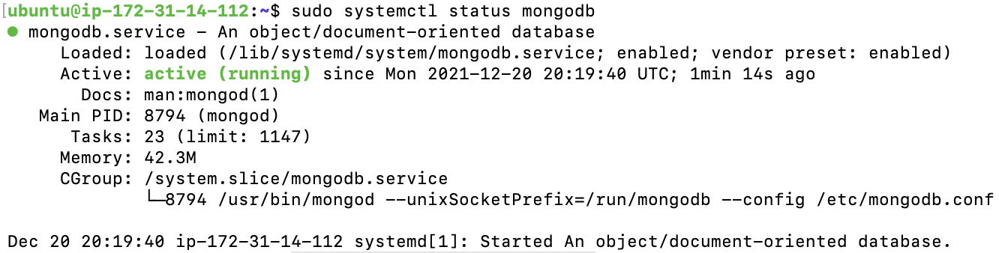
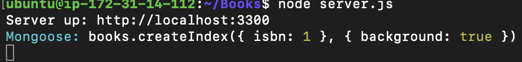
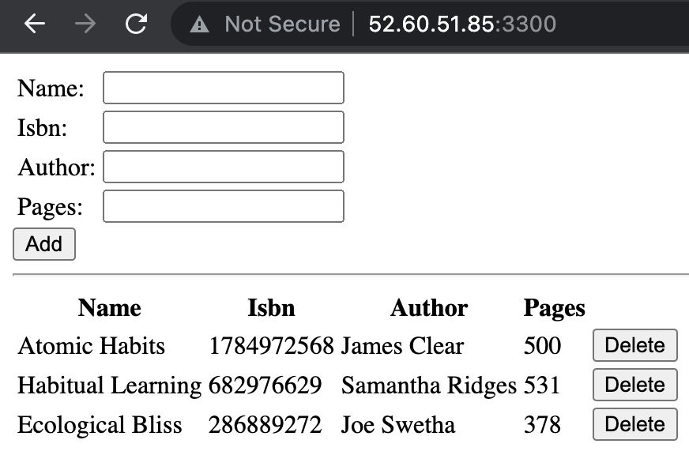

## Environment Setup

Signed into my AWS free tier account and created a new EC2 Instance of t2.nano family with Ubuntu Server 20.04 LTS (HVM) image.


## Install Node.js

`sudo apt update`

`sudo apt upgrade`

`sudo apt -y install curl dirmngr apt-transport-https lsb-release ca-certificates` Add certificate

`curl -sL https://deb.nodesource.com/setup_12.x | sudo -E bash -` - identify Node.js location in Ubuntu repository

`sudo apt install -y nodejs`

## Install MongoDB

MongoDB stores data in flexible JSON-like documents.

Book records will be added to MongoDB, and will contain book name, isbn number, author, and number of pages.

`sudo apt-key adv --keyserver hkp://keyserver.ubuntu.com:80 --recv 0C49F3730359A14518585931BC711F9BA15703C6` - Added the mongoDB key to my key server

`echo "deb [ arch=amd64 ] https://repo.mongodb.org/apt/ubuntu trusty/mongodb-org/3.4 multiverse" | sudo tee /etc/apt/sources.list.d/mongodb-org-3.4.list`

Then installed mongoDB

`sudo apt install mongodb -y`

Started server and checked status

`sudo system mongodb start`

`sudo systemctl status mongodb`



## Install npm – Node package manager
`sudo apt-get install aptitude -y` installed the aptitude package manager to install NPM, avoiding the

`sudo aptitude install npm -y`

Next install body-parser

`sudo npm install body-parser` - to help process JSON files passed in requests to the server

Next create a folder named "Books"

`mkdir Books && cd Books`

Within the Books directory initialized npm project and added the server.js file

`init npm`

`vi server.js`and paste into file the following code

```
var express = require('express');
var bodyParser = require('body-parser');
var app = express();
app.use(express.static(__dirname + '/public'));
app.use(bodyParser.json());
require('./apps/routes')(app);
app.set('port', 3300);
app.listen(app.get('port'), function() {
    console.log('Server up: http://localhost:' + app.get('port'));
});
```

## Install Express and setup Routes to the Server

Express a minimal and flexible **Node.js** web application framework with features for web and mobile applications. Express will be used to pass data to MongoDB Database.

I useed ***Mongoose*** to establish a schema for the database to store data of our book register

Within the Books Directory run the following commands:

`sudo npm install express mongoose`

`mkdir apps && cd apps`

Created the routes.js file in apps directory

`vi routes.js` and pasted the following code

```
var Book = require('./models/book');
module.exports = function(app) {
  app.get('/book', function(req, res) {
    Book.find({}, function(err, result) {
      if ( err ) throw err;
      res.json(result);
    });
  }); 
  app.post('/book', function(req, res) {
    var book = new Book( {
      name:req.body.name,
      isbn:req.body.isbn,
      author:req.body.author,
      pages:req.body.pages
    });
    book.save(function(err, result) {
      if ( err ) throw err;
      res.json( {
        message:"Successfully added book",
        book:result
      });
    });
  });
  app.delete("/book/:isbn", function(req, res) {
    Book.findOneAndRemove(req.query, function(err, result) {
      if ( err ) throw err;
      res.json( {
        message: "Successfully deleted the book",
        book: result
      });
    });
  });
  var path = require('path');
  app.get('*', function(req, res) {
    res.sendfile(path.join(__dirname + '/public', 'index.html'));
  });
};
```

Next I created the directory *models* within the apps directory

`mkdir models && cd models`

Next created the file *book.js*

`vi book.js` and pasted the following code.

```
var mongoose = require('mongoose');
var dbHost = 'mongodb://localhost:27017/test';
mongoose.connect(dbHost);
mongoose.connection;
mongoose.set('debug', true);
var bookSchema = mongoose.Schema( {
  name: String,
  isbn: {type: String, index: true},
  author: String,
  pages: Number
});
var Book = mongoose.model('Book', bookSchema);
module.exports = mongoose.model('Book', bookSchema);
```

## Access the routes with AngularJS

Changed directory baack to books

`cd ../..`

Created a directory named **public** and added a file **script.js** to it

`mkdir public && cd public`

`vi script.js` and pasted the following code.

```
var app = angular.module('myApp', []);
app.controller('myCtrl', function($scope, $http) {
  $http( {
    method: 'GET',
    url: '/book'
  }).then(function successCallback(response) {
    $scope.books = response.data;
  }, function errorCallback(response) {
    console.log('Error: ' + response);
  });
  $scope.del_book = function(book) {
    $http( {
      method: 'DELETE',
      url: '/book/:isbn',
      params: {'isbn': book.isbn}
    }).then(function successCallback(response) {
      console.log(response);
    }, function errorCallback(response) {
      console.log('Error: ' + response);
    });
  };
  $scope.add_book = function() {
    var body = '{ "name": "' + $scope.Name + 
    '", "isbn": "' + $scope.Isbn +
    '", "author": "' + $scope.Author + 
    '", "pages": "' + $scope.Pages + '" }';
    $http({
      method: 'POST',
      url: '/book',
      data: body
    }).then(function successCallback(response) {
      console.log(response);
    }, function errorCallback(response) {
      console.log('Error: ' + response);
    });
  };
});
```

Next in *public directory* I created another file **index.html**

`vi index.html` and pasted the following code.

```
<!doctype html>
<html ng-app="myApp" ng-controller="myCtrl">
  <head>
    <script src="https://ajax.googleapis.com/ajax/libs/angularjs/1.6.4/angular.min.js"></script>
    <script src="script.js"></script>
  </head>
  <body>
    <div>
      <table>
        <tr>
          <td>Name:</td>
          <td><input type="text" ng-model="Name"></td>
        </tr>
        <tr>
          <td>Isbn:</td>
          <td><input type="text" ng-model="Isbn"></td>
        </tr>
        <tr>
          <td>Author:</td>
          <td><input type="text" ng-model="Author"></td>
        </tr>
        <tr>
          <td>Pages:</td>
          <td><input type="number" ng-model="Pages"></td>
        </tr>
      </table>
      <button ng-click="add_book()">Add</button>
    </div>
    <hr>
    <div>
      <table>
        <tr>
          <th>Name</th>
          <th>Isbn</th>
          <th>Author</th>
          <th>Pages</th>

        </tr>
        <tr ng-repeat="book in books">
          <td>{{book.name}}</td>
          <td>{{book.isbn}}</td>
          <td>{{book.author}}</td>
          <td>{{book.pages}}</td>

          <td><input type="button" value="Delete" data-ng-click="del_book(book)"></td>
        </tr>
      </table>
    </div>
  </body>
</html>
```

Next changed directory back to *Books*

`cd ..`

Then started the server byu running:

`node server.js`

The server is started



To access the server from the internet, I opened Port 3300 in my AWS EC2 instance.

Accessed my web application on my web browser through my server public IP Address followed by :3300

Screenshot:




